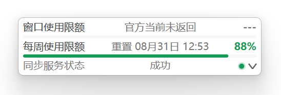
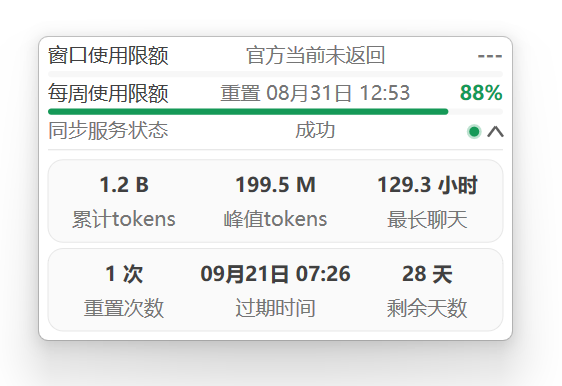
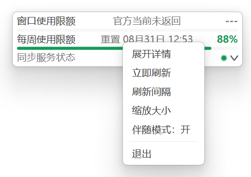

# Codex-Quota-Bar (C++ Win32 Direct2D Native)

[](LICENSE)
[](https://github.com/xiumu-ops/codex-quota-bar)
[](https://en.cppreference.com/w/cpp/20)
[](https://learn.microsoft.com/en-us/windows/win32/direct2d/direct2d-portal)
[](https://github.com/xiumu-ops/codex-quota-bar/actions/workflows/remote-build.yml)

基于 **C++20 / Win32 / Direct2D / DirectWrite** 构建的原生桌面配额指示条：常驻工作区顶部，通过 Codex 官方 App Server 实时展示窗口额度、每周额度、额度重置时间、Token 活动统计与同步状态。

本项目是独立的第三方开源工具，与 OpenAI 不存在隶属或背书关系。参阅[修改日志](CHANGELOG.md)、[隐私政策](PRIVACY.md)和[代码签名政策](CODE_SIGNING_POLICY.md)。

## 📸 界面预览与功能使用

### 1. 折叠状态（紧凑常驻栏）



- **核心功能**：
  - **额度进度直观呈现**：双色指示条分别展示当前 5 小时窗口额度与每周总额度剩余百分比与胶囊进度条。
  - **重置时间精准提示**：显示重置时间点（如 `重置 18:45` 或 `重置 08月29日 18:45`），清晰掌握额度重置周期。
  - **状态指示灯与文字**：实时反馈同步健康状态（🟢 成功 / 🟡 同步中 / 🔴 失败 / ⚪ 等待）。
- **交互方式**：
  - **左键单击右下角箭头（Chevron）**：展开或收起详细统计面板。
  - **左键按住主体拖动**：自由拖放至屏幕任意位置（跨多显示器、DPI 切换均保持清晰且自动持久化保存位置到 `config-users.json`）。
  - **左键双击主体区域**：立即向 Codex 发起即时额度与使用数据刷新。

---

### 2. 展开状态（详情面板）



- **核心功能**：
  - **精细额度指标**：展示 5 小时短期限额与每周长期限额的精确百分比与精确时刻。
  - **Token 使用统计卡片**：聚合展示累计 Token（`累计tokens`）、单日峰值 Token（`峰值tokens`）以及最长连续对话时长（`最长聊天`），数值智能折算（`K` / `M` / `B` / `T`）。
  - **重置额度卡片 (Reset Credits)**：展示账户可用额度重置次数（`重置次数`）、最早过期时间（`过期时间`）及剩余有效天数（`剩余天数`）。
- **交互方式**：
  - **再次左键单击右下角箭头**：收起详情面板回到紧凑状态。
  - **智能避让**：当窗口贴近屏幕底部时，详情面板将自动智能向上拓展展开，避免溢出屏幕。

---

### 3. 右键菜单（快捷设置）



- **核心功能与操作**：
  - **展开详情 / 收起详情**：快速切换卡片展开与折叠状态。
  - **立即刷新**：手动唤起临时 Codex App Server 进行即时额度与 Token 统计同步。
  - **刷新间隔**：支持切换自动刷新周期（1分钟 / 3分钟 / 5分钟 / 10分钟 / 15分钟 / 30分钟 / 60分钟）。
  - **缩放大小**：支持切换 UI 缩放比例（80% / 90% / 100% / 110% / 125% / 150%）。
  - **外观配置**：切换默认 / 个性外观，或在统一编辑器中修改 19 项颜色与 0%–90% 的背景透明度；支持应用、确定和取消。
  - **伴随模式（开/关）**：开启后，仅在官方 Codex 桌面端启动时自动显示并同步；Codex 退出后自动静默隐藏并于后台超轻量驻留。
  - **退出**：彻底关闭常驻进程并释放所有系统与图形资源。

---

## ✨ 架构特性

- **Direct2D 1.0 逐像素渲染**：`ID2D1DCRenderTarget` 将预乘 Alpha 画面绘制到内存位图，再由分层窗口交给 DWM 合成；窗口跳过背景擦除（`WM_ERASEBKGND`），支持真正的背景透明与圆角边缘
- **PerMonitorV2 感知 DPI**：按物理像素对齐绘制，跨屏拖动无缩放模糊
- **DirectWrite 现代排版**：Microsoft YaHei UI 中文字体渲染
- **固定向下展开**：详情面板始终追加在折叠栏下方（统计卡片 + 限额重置卡片）；底部空间不足时整体上移窗口
- **官方账户接口**：临时启动 `codex app-server`，通过 stdio JSON-RPC 调用 `account/rateLimits/read` 与 `account/usage/read`，无需额外常驻服务或开放本地端口
- **官方生命周期 Hook**：安装器注册 `SessionStart`、`Stop`、`SessionEnd`，新会话、每轮对话完成和会话结束时自动同步
- **伴随模式**：可从右键菜单启用；Codex 桌面端启动时自动显示，桌面端退出后防抖隐藏，并通过当前用户启动项在登录后后台等待
- **当前用户安装与卸载**：单文件安装包默认写入 `%LOCALAPPDATA%\Codex-Quota-Bar\app`，程序、配置、开始菜单和“已安装的应用”入口全部限定在当前用户
- **Win32 命名管道 IPC**：单实例守护进程，CLI / IDE / Git Hook 毫秒级通信（命令表见下）
- **零第三方运行库**：程序只使用 Windows 系统组件；额度同步需要已安装并登录的官方 Codex

---

## 🛠️ 构建与运行

```powershell
# 1. 构建（Windows 11 x64 / MSVC）
.\scripts\build.ps1

# 2. 运行（后台常驻）
.\scripts\run.ps1

# 3. 完整回归测试（会先强制重建当前源码）
.\scripts\test.ps1

# 4. 清除编译缓存，保留 dist 发布文件
.\scripts\clean.ps1
```

运行前请确认 Codex 桌面端或 CLI 已安装并完成登录。程序会自动发现桌面端附带的 `codex.exe`。

源码构建要求 Visual Studio 2022 Build Tools，并安装“使用 C++ 的桌面开发”工作负载和 Windows 11 SDK。发布程序使用静态 MSVC 运行库，不要求目标机器另装 VC++ Redistributable。

所有 CMake、MSBuild、可执行主程序与安装器中间文件统一写入隐藏目录 `.build\`；`dist\Release` 只保存可分发的单文件安装器及其 SHA256 校验文件。如需连同发布文件一起清理，执行 `.\scripts\clean.ps1 -IncludeDist`。

### GitHub Actions 远程构建

仓库内置 `.github/workflows/remote-build.yml`，工作流显示名称为 `Codex-Quota-Bar Remote Build`，固定使用带 Visual Studio 2022、MSVC 与 Windows SDK 的 `windows-2025`（Windows Server 2025 x64）执行器。推送到 `main`、向 `main` 提交 Pull Request，或者在 GitHub `Actions > Codex-Quota-Bar Remote Build > Run workflow` 手动运行时，会依次执行完整回归测试、构建安装器、校验 SHA256，并在临时 Runner 中实际验证当前用户安装、HKCU 注册、Hook、快捷方式和卸载清理，最后上传保留 30 天的构建产物。

普通构建成功后，打开对应的 Actions 运行记录，在页面底部的 `Artifacts` 区域下载 `Codex-Quota-Bar_version_<版本号>`。压缩包中包含同名版本安装器和 SHA256 文件；普通分支构建不会自动公开发布。

正式版本使用语义化标签发布。标签必须与 `CMakeLists.txt` 中的项目版本完全一致；例如发布 2.5.8：

```powershell
git tag -a v2.5.8 -m "Codex-Quota-Bar 2.5.8"
git push origin v2.5.8
```

标签流水线通过同一套回归、安装与卸载测试后，会自动创建非草稿、非预发布的 GitHub Release，生成发布说明，并将 `Codex-Quota-Bar_version_2.5.8.exe` 与 `Codex-Quota-Bar_version_2.5.8.sha256` 作为正式下载文件上传。推送不匹配项目版本的标签会直接失败，不会创建错误版本的 Release。

如需在云端签名，在仓库的 `Settings > Secrets and variables > Actions` 中添加：

- `WINDOWS_SIGNING_PFX_BASE64`：PFX 证书文件的 Base64 内容
- `WINDOWS_SIGNING_PFX_PASSWORD`：PFX 证书密码

签名证书只在非 Pull Request 构建中临时导入当前 Runner 的用户证书库，构建后立即移除。没有配置这两个 Secret 时工作流仍会生成未签名安装包并报告其签名状态；云端编译本身不会消除 Defender 对未签名程序的信誉检查。

### 项目目录

```text
assets/       icons/ 应用图标与 screenshots/ README 预览截图
src/          EXE 源码、同模块头文件与 resources/ Win32 资源
installer/    安装器、卸载器及 Hook 配置实现
tests/        App Server、Hook 与异常路径测试
scripts/      构建、运行、测试、安装包与清理脚本
dist/         最终单文件安装器与 SHA256；可删除、可重新生成
.build/       隐藏的编译缓存；不纳入版本控制
.github/      GitHub Actions 远程构建与正式发布流程
config-default.json  程序默认设置、字体与完整颜色基线
CHANGELOG.md  各版本新增、变更与修复记录
```

项目采用单体 Win32 EXE 的共置布局，模块头文件与实现文件放在同一 `src/<Module>` 目录。仓库根目录保留构建入口、README、修改日志、许可证、隐私政策和代码签名政策等项目级文件。

### 安装包

直接运行发布目录中的 `Codex-Quota-Bar_version_2.5.8.exe` 即可安装。发布目录只包含安装器及其 SHA256 文件，主程序作为安装器内部载荷构建。首次交互式安装会打开目录选择器，所选位置下自动创建独立的 `Codex-Quota-Bar` 根目录及 `app`、`data` 分层；默认结构为：

```text
%LOCALAPPDATA%\Codex-Quota-Bar\
├─ app\
│  ├─ Codex-Quota-Bar.exe
│  ├─ config-default.json
│  └─ Uninstall.exe
└─ data\
   ├─ config-users.json
   ├─ diagnostic.log
   └─ diagnostic.previous.log
```

安装器以当前用户权限运行且不请求 UAC；卸载入口写入 `HKCU`，快捷方式只创建在当前用户开始菜单中。自定义路径必须使用名为 `Codex-Quota-Bar` 的独立根目录，卸载器通过注册的 `InstallLocation` 精确校验 `app` 子目录后才删除，避免误删用户选择位置中的其他文件。静默安装使用默认路径；重新安装沿用已注册的位置。

安装器检测到早期系统级版本的 HKLM 卸载项时会停止安装，并要求先从 Windows“已安装的应用”卸载旧版，避免 `%ProgramFiles%` 与 `%LOCALAPPDATA%` 同时残留两份程序。

卸载器仅在 Windows 锁定正在运行的 `Uninstall.exe`、需要调用系统原生 `MOVEFILE_DELAY_UNTIL_REBOOT` 完成最终删除时请求管理员权限；Hook、伴随启动项、HKCU 卸载项、当前用户快捷方式和配置本身都不需要管理员权限。项目不复制临时卸载器，也不使用 `cmd.exe` 或脚本自删除。

窗口设置、伴随模式启动项以及 Codex Hook 均保持当前用户范围。安装器通过当前用户的 `~/.codex/hooks.json` 注册会话同步 Hook，不读取或修改高敏感的 `config.toml`；`hooks.json` 使用临时文件原子替换，若其中已有其他 Hook 或元数据，会结构化合并并精确保留整数等 JSON 数值。重新安装时会备份现有程序、卸载器和快捷方式，任何关键步骤失败都会恢复原安装。

卸载时只识别并移除调用 `Codex-Quota-Bar.exe --hook` 的三个处理器；文件仅由本软件创建且清空后会一并删除。伴随模式启动项也会始终移除。

首次安装或 Hook 命令路径变化后，Codex 会按照官方安全机制跳过尚未信任的非托管 Hook。请在 Codex 中输入 `/hooks`，审核并信任新增的三个 Hook。官方说明见 [Codex Hooks 文档](https://learn.chatgpt.com/docs/hooks)。

从源码生成安装包需要 Visual Studio Build Tools（MSVC 与 Windows Resource Compiler）：

```powershell
.\scripts\build-installer.ps1
```

正式发布可通过代码签名证书指纹签名应用、卸载器和安装器；脚本会在签名后执行 Authenticode 校验，再计算安装包哈希：

```powershell
$env:CODEX_QUOTA_SIGN_CERT_THUMBPRINT = "证书 SHA-1 指纹"
.\scripts\build-installer.ps1
```

未提供证书时仍可构建，但脚本会明确警告产物未签名。项目不会自动创建或信任自签名证书。

输出文件：

```text
dist\Release\Codex-Quota-Bar_version_2.5.8.exe
dist\Release\Codex-Quota-Bar_version_2.5.8.sha256
```

安装器支持 `/quiet` 或 `/s` 静默安装；已安装的 `app\Uninstall.exe /quiet` 可执行静默卸载并默认保留 `data`。卸载顺序固定为：精确移除本软件的 Hook、删除伴随启动项、终止全部实例、隔离主程序路径，最后删除 `app`。交互卸载选择删除本地设置时会同时删除 `data`；若根目录随后为空会一并删除。正在运行的卸载器映像若仍被 Windows 占用，会登记在下次系统启动时删除并明确提示需要重启。

### Defender 与代码签名

公开发布的安装器、主程序和卸载器应使用同一个受信任发布者证书完成 Authenticode 签名与时间戳。未签名的新 Win32 程序无法继承发布者信誉，并且本程序需要启动 `codex app-server`、使用命名管道以及按用户选择注册伴随启动项，容易被 Defender 机器学习模型误判。项目不建议通过添加 Defender 排除项绕过检测。

如干净构建被 Defender 判定为恶意软件，应将安装器、主程序和卸载器分别提交到 [Microsoft Security Intelligence 文件提交入口](https://www.microsoft.com/wdsi/filesubmission)，选择软件开发者和误报场景。构建脚本支持通过 `CODEX_QUOTA_SIGN_CERT_THUMBPRINT` 指定签名证书；自签名证书仅适合受控开发环境，不适合公开分发。

---

## ⌨️ CLI 命令

带参数启动时向运行中的实例发送命令；无参数启动进入常驻 GUI。所有命令以退出码报告结果：`0` 表示命令已发送并得到 `OK` 回复，`1` 表示未知命令、未知参数或实例未运行。

| 命令                                    | 说明                                                            |
| ------------------------------------- | ------------------------------------------------------------- |
| `--worker BUSY`                       | Hook 兼容命令：回执成功，不存储、不显示任何工作状态                                  |
| `--worker IDLE` / `READY`             | Hook 兼容命令：回执成功，不改变界面                                          |
| `--worker DONE`                       | 收到命令后立即刷新额度；安装器注册的官方 `Stop` Hook 会在每轮对话完成时自动调用                |
| `--worker OFFLINE`                    | Hook 兼容命令：回执成功，不改变界面                                          |
| `--worker STATUS <文本>`                | Hook 兼容命令：接受文本并回执成功，不改变界面（可超 4KB，长消息自动分块读取）                   |
| `--worker STATS <v1> <v2> <v3> <v4>`  | 手动覆盖统计卡片（兼容旧 Hook）：累计 Token、峰值 Token、最长聊天、连续天数。下一次成功自动同步会替换该值 |
| `--worker REFRESH`                    | 立即刷新配额数据                                                      |
| `--hook SessionStart/Stop/SessionEnd` | 安装器写入的 Codex 生命周期入口；实例未运行时会启动额度条并强制同步                         |
| `--refresh` / `-r`                    | 立即刷新配额数据                                                      |
| `--toggle` / `-t`                     | 显示/隐藏切换                                                       |
| `--show`                              | 显示窗口                                                          |
| `--hide`                              | 隐藏窗口                                                          |
| `--exit` / `-x`                       | 优雅退出运行中的实例                                                    |

未知参数会向 stderr 打印用法并以退出码 `1` 结束，不会静默启动 GUI。

---

## ⚙️ 配置

### 统一应用配置

默认基线与用户设置分开保存：

```text
%LOCALAPPDATA%\Codex-Quota-Bar\app\config-default.json
%LOCALAPPDATA%\Codex-Quota-Bar\data\config-users.json
```

`config-default.json` 随程序安装，保存完整默认设置、字体和颜色基线；`config-users.json` 保存用户设置、个性外观和窗口位置。加载时先读取默认基线，再按字段叠加用户配置。程序不读取旧版 `data\config.json`，升级前如需保留设置，应手动按新版结构写入 `config-users.json`。自定义安装位置时，两份文件仍分别位于安装根目录的 `app` 与 `data`。诊断日志位于 `data`，单文件最多 256 KiB，并只保留一份轮换副本；日志不会记录原始 App Server JSON、Token 明细或账户标识。卸载时选择删除本地设置会删除整个 `data`（包括用户配置和诊断日志），选择保留则只移除 `app`；重新安装会恢复新的默认配置。

### 默认外观与个性外观

右键额度条，选择 **外观配置 > 编辑个性外观**，可在统一风格的窗口中输入全部 19 项颜色、查看即时色块预览，并以百分比设置 0%–90% 的背景透明度。颜色只接受严格的 `#RRGGBB` 格式，透明度只接受范围内的整数；错误项会自动定位并以内联提示标出。

底部“应用”会立即保存并启用个性外观，但保留编辑窗口；“确定”保存并关闭；“取消”关闭窗口，已经通过“应用”保存的修改不会回退。

“使用默认外观 / 使用个性外观”分别切换 `Default` 与 `Custom`，每次点击都会重新读取并应用对应配置。默认外观始终使用 `config-default.json` 的完整基线和 0% 透明度，但不会删除已保存的个性值；个性透明度只改变主卡片与展开态子卡片背景，文字、进度条、状态灯、边框和右键菜单保持不透明。

两份配置都是标准 JSON，不支持注释。字体必须是 Windows 已安装的字体族名称。`config-default.json` 必须包含完整颜色字段；`config-users.json` 中的颜色字段可以省略，省略时继承默认基线。完整用户配置格式如下：

```json
{
  "Version": 2,
  "Settings": {
    "UserScale": 1.0,
    "CompanionMode": false,
    "RefreshIntervalMinutes": 1,
    "Appearance": {
      "Mode": "Custom",
      "FontFamily": "Microsoft YaHei UI",
      "BackgroundTransparency": 30,
      "Colors": {
        "Surface": "#FFFFFF",
        "StatsCardBackground": "#FAFAFA",
        "StatsCardBorder": "#E0E0E0",
        "Text": "#404040",
        "MutedText": "#757575",
        "TrackBackground": "#F7F7F7",
        "Unavailable": "#757575",
        "ProgressHigh": "#159957",
        "ProgressMedium": "#D9A900",
        "ProgressLow": "#D76B26",
        "ProgressCritical": "#C00000",
        "OuterBorder": "#FFFFFF",
        "Divider": "#E0E0E0",
        "Chevron": "#5F5F5F",
        "SyncSuccess": "#159957",
        "SyncIdle": "#A8A8A8",
        "SyncBusy": "#D9A900",
        "MenuHover": "#F0F0F0",
        "MenuDivider": "#EAEAEA"
      }
    }
  },
  "Window": null
}
```

程序分别校验默认配置和用户配置：默认文件必须包含完整外观基线；用户文件中的未知颜色名、错误类型、非法色值、无效字体名称，以及不是 0–90 整数的背景透明度，都会显示具体配置路径。若 JSON 本身损坏或存在未修正的字段错误，程序不会用默认内容覆盖该文件。系统中不存在的字体会在运行时回退到可用字体并给出提示。

### Codex App Server

默认同步流程：

```text
codex app-server
  → initialize
  → initialized
  → account/rateLimits/read
  → 按 300 / 10080 分钟识别窗口额度与每周额度（各行中部的重置时间取自对应限额的 resetAt）
  → 读取 rateLimitResetCredits.availableCount 与 credits[].expiresAt
  → account/usage/read
  → 读取 lifetimeTokens / peakDailyTokens / longestRunningTurnSec / currentStreakDays
  → 关闭临时 App Server 进程
```

统计卡片展示账户累计 Token、单日 Token 峰值与最长聊天时长。Token 数值自动缩写为 `K` / `M` / `B` / `T`，所有缩写单位固定保留两位小数（数字与单位之间带空格，如 `24.50 B`）；聊天时长不足一小时按分钟显示，其余统一折算为总小时（如 `129 小时`）。

展开态第二张「重置」子卡片为三列官方指标：**重置次数**取 `rateLimitResetCredits.availableCount`；**过期时间**取可用重置额度详情中最早的 `credits[].expiresAt`（本地时间 `MM月DD日 HH:MM`）；**剩余天数**为距该到期时间还剩的天数（不足一天按一天计）。服务只返回次数而未返回详情时，到期时间与剩余天数显示 `--`，不会再用额度窗口的 `resetsAt` 冒充。

程序依次从 `CODEX_QUOTA_CODEX_PATH`、`%LOCALAPPDATA%\OpenAI\Codex\bin` 和 Program Files 查找 `codex.exe`。自定义安装可显式指定：

```powershell
$env:CODEX_QUOTA_CODEX_PATH = "D:\path\to\codex.exe"
.\scripts\run.ps1
```

### 应用清单

`src\resources\app.rc` 会把同目录的 `app.manifest`（Windows 11、PerMonitorV2 DPI 感知）编译并嵌入主程序；构建流程同时将仓库根目录的 `config-default.json` 复制到主程序旁。安装后主程序名为 `Codex-Quota-Bar.exe`，发布安装器使用带版本号的文件名。项目只保留 MSVC x64 构建路径；如需修改 DPI、兼容性声明或默认主题，分别编辑清单或默认配置后重新构建即可。

### 伴随模式

右键悬浮栏选择 **伴随模式：关/开**。启用后程序会：

1. 在 `HKCU\Software\Microsoft\Windows\CurrentVersion\Run` 写入当前 EXE 的启动项；
2. 每 2 秒检查一次官方 Codex 桌面端进程；
3. Codex 启动时自动显示并立即同步；
4. 首次轮询未发现 Codex 时立即隐藏窗口并停止额度抓取，关闭后的检测延迟约为 0～2 秒；
5. 保留轻量后台进程，以便同一登录会话内下一次启动 Codex 时重新显示。

检测仅接受官方 Codex 安装路径中的桌面宿主 `ChatGPT.exe` 或启动器 `Codex.exe`，明确排除 `resources\codex.exe` 与 `%LOCALAPPDATA%\OpenAI\Codex\bin` 下的 CLI/App Server。右键“退出”或 `--exit` 仍会彻底结束后台进程；关闭伴随模式会同步移除当前用户启动项。

---

## ⚠️ 已知限制与安全说明

- **管道访问控制**：命名管道使用登录会话专属名称、受保护的显式 DACL 和中完整性写入限制，仅允许对象所有者、SYSTEM 与管理员访问，并拒绝远程客户端。与应用运行在同一用户和同一会话、且满足完整性要求的本地进程仍可发送受支持命令（包括 `EXIT`）；这是当前用户桌面 IPC 的权限边界。
- **Codex 路径信任**：额度同步自动发现仅检查官方桌面端常用安装目录；显式设置 `CODEX_QUOTA_CODEX_PATH` 表示用户信任该可执行文件。伴随进程检测另行校验官方 Codex 桌面安装路径，并排除 CLI/App Server 路径。
- **工作状态命令零 UI 影响**：`BUSY` / `IDLE` / `DONE` / `OFFLINE` / `STATUS` 仅为兼容 Hook 保留——服务端接受命令并回执 `OK`，但不存储、不显示任何工作状态；底部文字和指示灯只反映额度同步状态。安装器注册的官方 `Stop` Hook 会在每轮对话完成时调用 `DONE` 并触发刷新。
- **`STATS` 字段分隔**：该命令只用于兼容手动 Hook；四个字段以空格分隔且字段内容不可包含空格。正常运行时统计卡片由 `account/usage/read` 自动更新；接口未返回过有效值时才显示 `--`。
- **命令大小上限**：单条命令上限 64KB（消息模式管道）；超限会回复 `TOO_LONG` 并断开连接，客户端以退出码 `1` 报告失败。受 CreateProcess 32767 字符命令行上限约束（UTF-16 约 65,534 字节），正常 CLI 调用无法触及该上限。

---

## 📄 开源许可证 (License)

本项目基于 [MIT License](LICENSE) 开源。正式发布遵循[代码签名政策](CODE_SIGNING_POLICY.md)，本地数据处理参阅[隐私政策](PRIVACY.md)。

